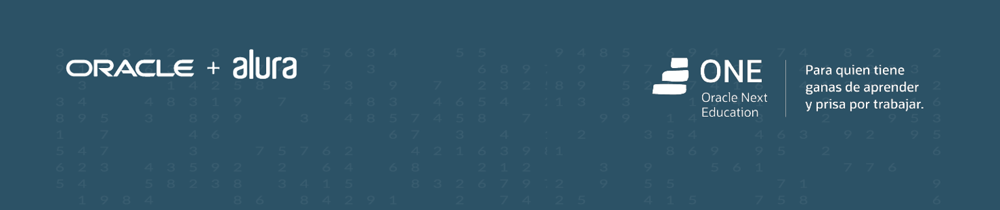

# MYSTERY FRIEND: A CHALLENGE FROM ORACLE ONE PROGRAM

*You can read the original article in Spanish [here](README.md).*

## ABOUT ORACLE ONE PROGRAM

This project is a proposed challenge for the 8th group of candidates in the "Oracle Next Education" program (Oracle ONE), which is a initiative led by Oracle and Alura Latam. In this program, the selected participants develop programming skills aiming to enhance their professional careers.
For more information about the program, visit its [website (in Spanish)](https://www.oracle.com/pe/education/oracle-next-education/).

## PROJECT DESCRIPTION

This challenge aims to develop a JavaScript program that allows the user to randomly select a "Mystery Friend" from a provided list of names. The main functionalities implemented are:

- **`Validation of names containing only letters 🔤:`** Using regular expressions.
- **`Validation of spaces and blank inputs ✅:`** The program only allows valid names to be entered. Blank data cannot be submitted.
- **`Validation of duplicate names 🔁:`** The same name cannot be entered more than once. This validation works even if the name is written in uppercase or with extra spaces at the beginning or end.
- **`Validation of number of names entered 🔢:`** The selection can only be executed when at least two names are provided.
- **`User experience improvements ⌨️:`** The user can enter the names by clicking the "Add" ("Añadir") button or by pressing ENTER. Additionally, a "New Game" ("Nuevo Juego") button was created, allowing the user to play multiple times!

